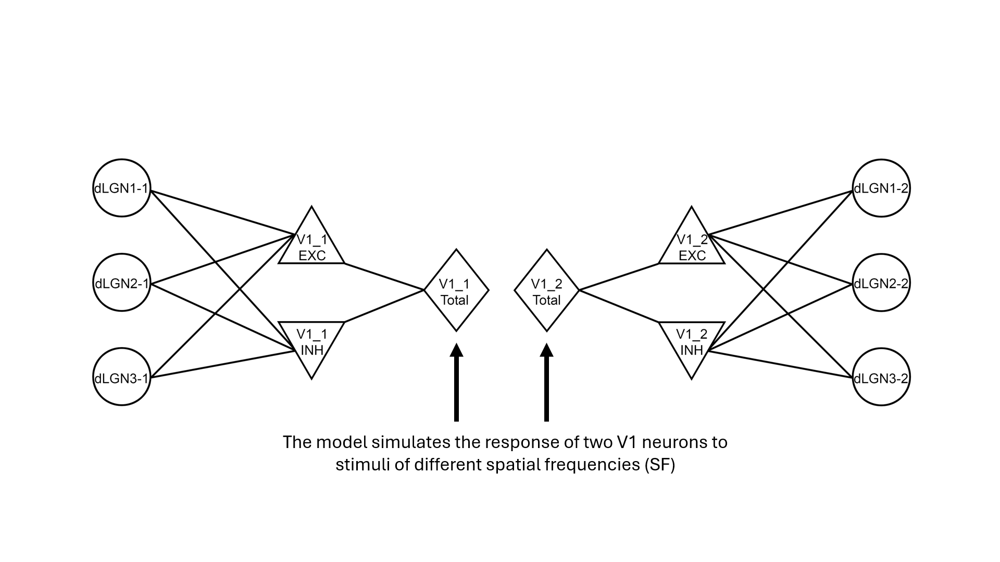
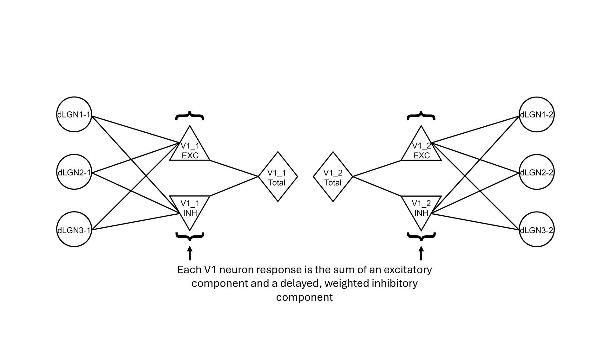
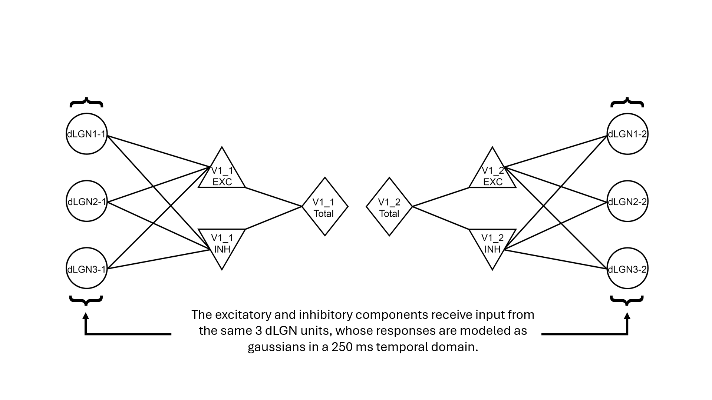
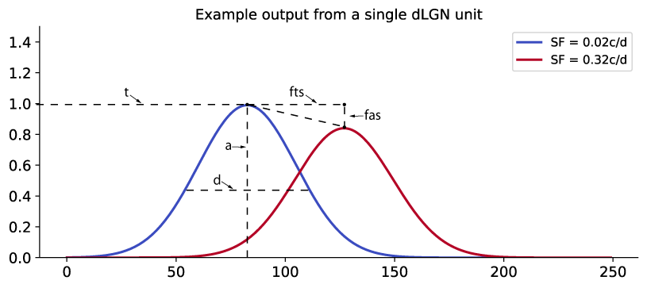

## Synergistic Geniculocortical Circuit Model (SGCC)

The purpose of this project is to create a simple computational model of the geniculocortical pathway in the mouse visual system to understand and characterize the circuit motifs that enable the efficient spatial frequency (SF) codes described in Elsayed (2025). The following are questions addressed by the model:

1) What are the functional properties of dLGN units that preferentially connect to distinct V1 units?
2) What are the inhibitory dynamics driving each distinct V1 unit?
3) What happens to SF decorrelation if coarse-to-fine processing and/or inhibition are turned off in the system?

### Model Architecture:

### Model Parameters:

Model parameters are split into dLGN parameters and V1 parameters.

dLGN parameters:

    "fts": Frequency-time slope - controls how coarse-to-fine a dLGN unit response is.
    "t": Time intercept parameter - onset time of the lowest SF response.
    "fas": Frequency-amplitude slope - controls the decay of response amplitude with SF.
    "a": Amplitude intercept parameter - initial amplitude of the lowest SF response.
    "d": Response duration - duration of the dLGN uni response.

Schematic showing what each dLGN parameter controls:

