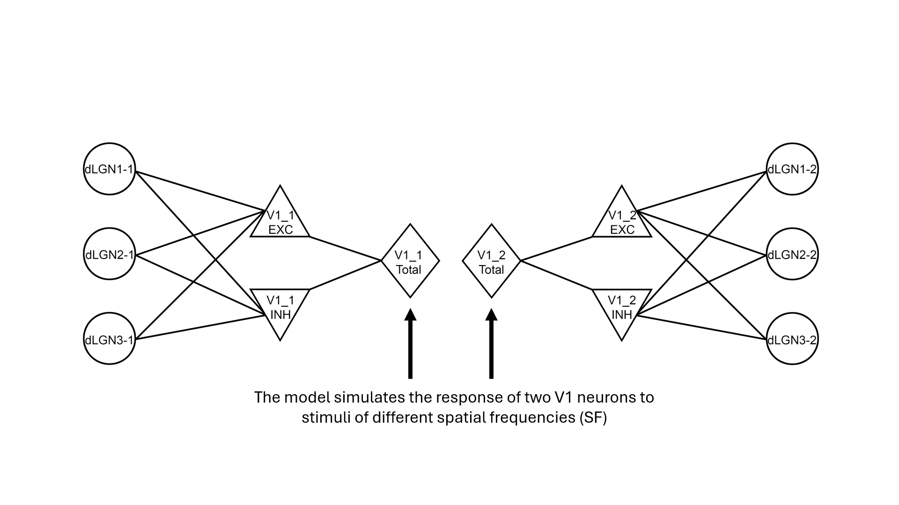
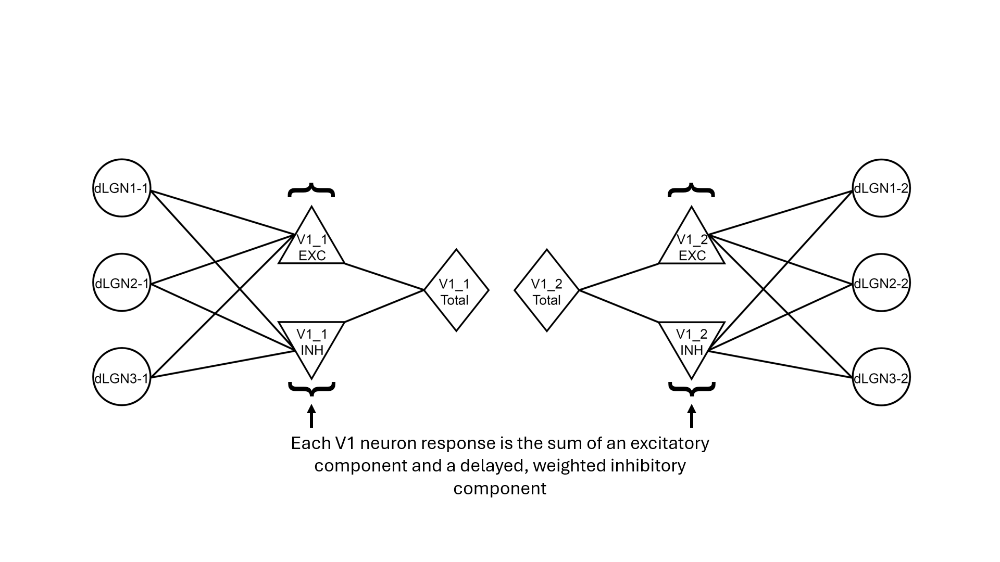
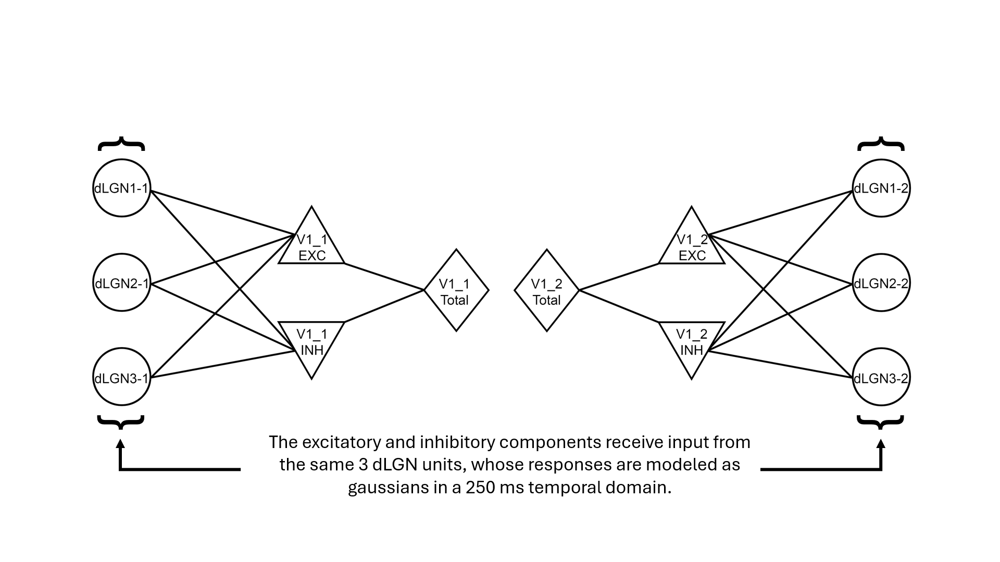
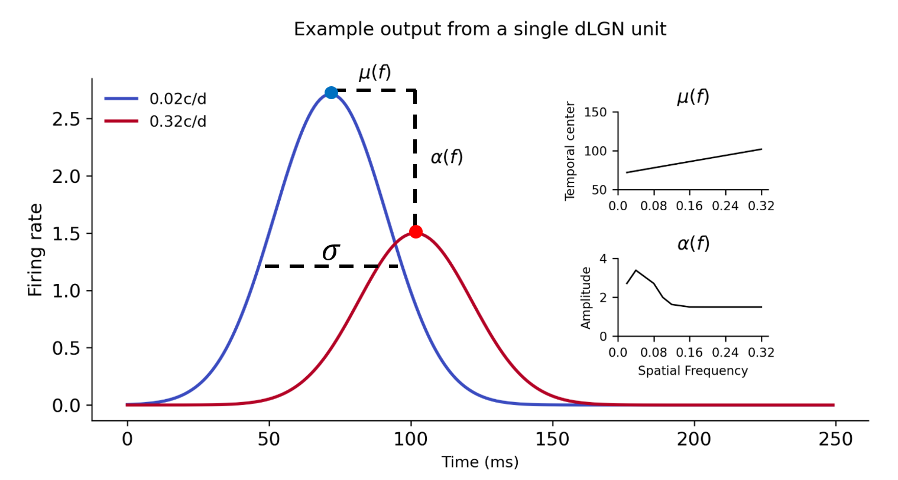
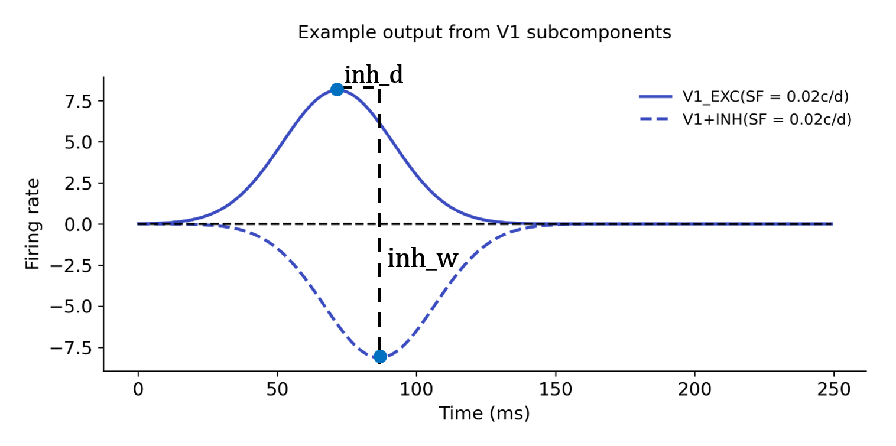
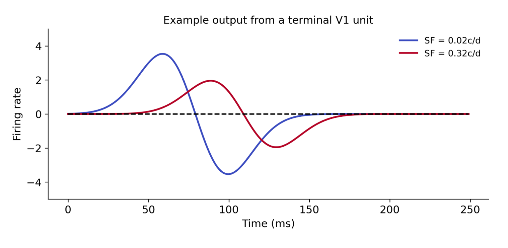

## Synergistic Geniculocortical Circuit Model (SGCC)

The purpose of this project is to create a simple computational model of the geniculocortical pathway in the mouse visual system to understand and characterize the circuit motifs that enable the efficient spatial frequency (SF) codes described in Elsayed (2025). The following are questions addressed by the model:

1) What are the functional properties of dLGN units that preferentially connect to distinct V1 units?
2) What are the inhibitory dynamics driving each distinct V1 unit?
3) What happens to SF decorrelation if coarse-to-fine processing and/or inhibition are turned off in the system?

### Model Architecture:

### Model Parameters:

Model parameters are split into dLGN parameters and V1 parameters.

dLGN parameters: The dLGN response is a Gaussian function with respect to SF and time.
The temporal bandwidth (duration of the response) is controlled by the &\sigma& parameter.
The center of the Gaussian is controlled by a linear function of SF with a frequency-time 
intercept and a frequency-time slope. The amplitude is controlled by another Gaussian function
of SF with its own center, midline, gain (amplitude), and tuning bandwidth. Below is a breakdown
of all the tunable dLGN parameters: 

    Temporal bandwidth (\sigma) - Controls the time duration of each SF evoked response.
    
    Frequency-time intercept (fti) - The intercept of $\mu$(f). Controls the initial onset timing 
    of the SF evoked response.
    
    Frequency-time slope (fts) - The slope of $\mu$(f). Controls the relative timing of SF evoked 
    responses for values above 0 c/d. Relates to the "coarse-to-fine" dynamics of the response.
    
    Amplitude center (ampc) - The mean of $\alpha$(f). This is the frequency at the peak of the 
    unit's SF tuning curve. 

    Amplitude midline (ampm) - The midline of $\alpha$(f). Controls the baseline amplitude across the 
    unit's entire SF tuning curve.

    Amplitude gain (ampg) - The amplitude of $\alpha$(f). Controls the peak amplitude of the preferred 
    SF in the unit's SF tuning curve.

    Amplitude bandwidth (ampw) - The standard deviation of $\alpha$(f). Controls the sharpness of the
    unit's SF tuning curve.

Schematic showing what each dLGN parameter controls:

V1 Parameters: The response profile in the excitatory and inhibitory V1 subcomponents are just a summation
of 3 dLGN unit outputs. The inhibitory component is identical to the excitatory component but scaled and
temporally shifted.

    "inh_d": Inhibition delay - temporal delay between the excitatory and inhibitory V1 components.
    "inh_w": Inhibition weight - gain/scaling parameter for the inhibitory V1 component.

Schematic showing what each V1 parameter controls. For ease of visualization, only a single SF response is shown:

### Project data:

All data necessary to run the notebooks in the analysis folder is available on Figshare: https://doi.org/10.6084/m9.figshare.31875571

Steps for running the analysis folders:

1) Clone or download the repository.
2) Make a new folder named "project_datafiles" inside the "SGCC" folder
3) Download the data files from figshare
4) Move or copy the data to the "project_datafiles" folder.
